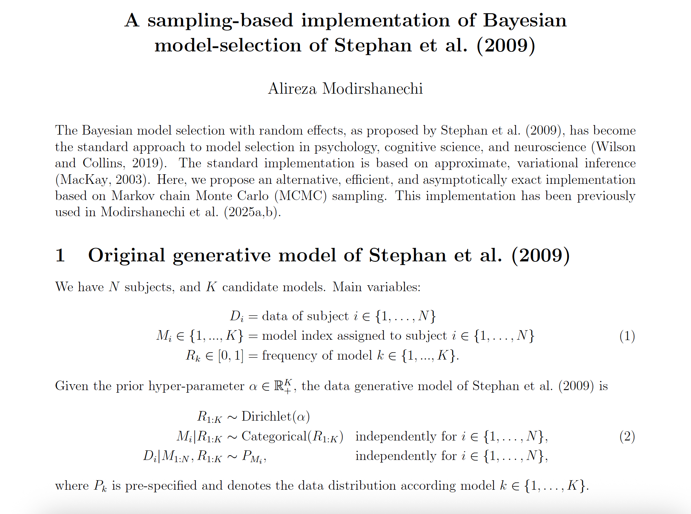
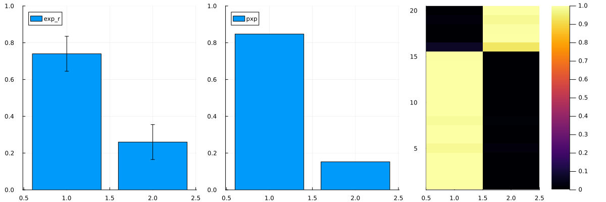
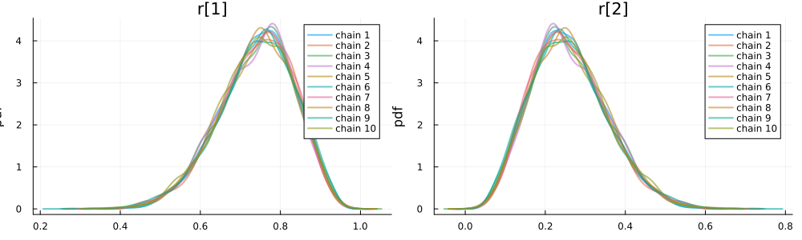

<div align="center">

# MCMCbasedBayesianMS.jl

</div>

This package provides a sampling-based implementation of the Bayesian model-selection method of [Stephan et al. (2009) in NeuroImage](https://doi.org/10.1016/j.neuroimage.2009.03.025). Earlier versions of this code were used for the analyses in [Modirshanechi et al. (2025a)](https://doi.org/10.1101/2022.07.05.498835) and [Modirshanechi et al. (2025b)](https://osf.io/preprints/psyarxiv/cnkyz_v2).


## Installation

The theoretical details behind the implementation of the package are provided in [`theory.pdf`](theory.pdf).

[](theory.pdf)


## Installation

```julia
using Pkg; Pkg.add(url = "https://github.com/modirshanechi/MCMCbasedBayesianMS.jl.git")
```

## Usage

```julia
using MCMCbasedBayesianMS

# generating a synthetic data set
#   20 subjects * 2 models
#   LMatrix[n,m] = log-prob of subject n under model m
LMatrix = (rand(20,2) .- 1) * 10;
#   assigning the first 15 to model 1 and the rest to model 2
LMatrix[1:15,1] .+= 10; LMatrix[16:20,2] .+= 10; 

# Bayesian Model Selection (BMS) object with 10 chains and 100K samples per chain
BMS = BMSObj(LMatrix, 
        bms_basechain = BMSBase(n_chains = 10, n_samples = 100000),
        bms_borsamp = BMSBorSampNaive(n_samples = 100000))

# performing inference
InfResults = doBMSinference(BMS)

# plotting the statistics
plotstats(InfResults)
```
Expected outcome:


```julia
# plotting the density of model frequency for different chains
plotrsamples(InfResults,figsize=(500,300))
```
Expected outcome:

